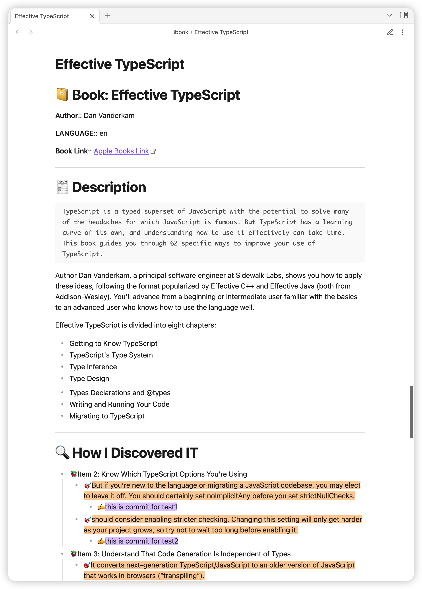

# Obsidian iBooks Plugin

It allows you to export your mac ibook hightlights and annotations into your obsidian vault.

# Demo Screenshot



# Attention

- If you want to use highlighted text's color from iBook, use  [this template](https://github.com/bingryan/obsidian-ibook-plugin/blob/master/docs/example.md#ibook-selected-colors)

# Requirements (exists default)

The data of mac ibook exists in local sqlite3. and this plugin select database use the local SQLite3

```shell
brew install sqlite3
```

# How to Use

### Export All

`cmd + p` and input `iBooks Export`

### Export a Single Book by Searching Your Library

`cmd + shift + b` and search by `Book Title or Author`


### Export Book Info by Search [goodreads](https://www.goodreads.com/)

`cmd + shift + i` use file name to search book info, and insert current cursor position


# Features

[✓] Support Export by Search Book Name/Author

[✓] Export iBooks hightlights and annotations into your Obsidian vault

[✓] User-defined Template Option (Default Provided)

[✓] Search book info by [goodreads](https://www.goodreads.com/)

[✗] More...

# For User-Defined Templates

1. Templating Language: [https://handlebarsjs.com/](https://handlebarsjs.com/)
   1. Built-in Loaded [handlebars-helpers](https://github.com/helpers/handlebars-helpers), [handlebars-group-by](https://github.com/shannonmoeller/handlebars-group-by)
2. Available Parameters: [docs/parameters.md](docs/parameters.md)

If you don't know how to use these, you can visit [example](docs/example.md), and anyone is welcome to provide templates by PR

# How to Install
## From within Obsidian

you can activate this plugin within Obsidian by doing the following:

- Open Settings > Third-party plugin
- Make sure Safe mode is **off**
- Click Browse community plugins
- Search for "Apple iBooks Highlight and Note Importer"
- Click Install
- Once installed, close the community plugins window and activate the newly installed plugin
