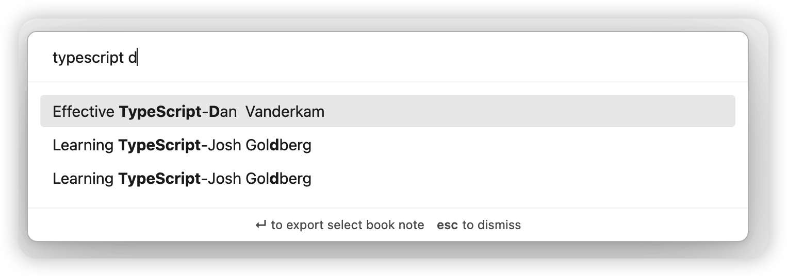
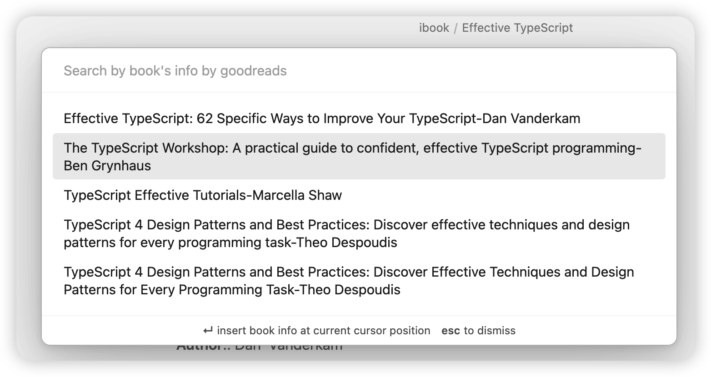

# Obsidian ibook Plugin

It allows you to export your mac ibook hightlights and annotations into your obsidian vault.

# Demo Screenshot


# Requirements

The data of mac ibook exists in local sqlite3. and this plugin select database use the local SQLite3

```shell
brew install sqlite3
```

# How to Use

### export all

`cmd + p` and input `ibook export`

### export single book by search

`cmd + shift + b` and search by `book name/author`



### export book info by search [goodreads](https://www.goodreads.com/)

`cmd + shift + i` and search by book info, and insert current cursor position



# Features

[✓] support export by search book name/author

[✓] export ibook hightlights and annotations into your obsidian vault.

[✓] user-defined template

[✓] search book info by [goodreads](https://www.goodreads.com/)

[✗] More...

# For User-Defined Templates

1. templating language: [https://handlebarsjs.com/](https://handlebarsjs.com/)
   1. built-in loaded [handlebars-helpers](https://github.com/helpers/handlebars-helpers), [handlebars-group-by](https://github.com/shannonmoeller/handlebars-group-by)
2. available parameters: [docs/parameters.md](docs/parameters.md)

If you don't know how to use these, you can visit [example](docs/example.md), and anyone is welcome to provide templates by PR

# How to Install
## From within Obsidian

you can activate this plugin within Obsidian by doing the following:

- Open Settings > Third-party plugin
- Make sure Safe mode is **off**
- Click Browse community plugins
- Search for "Obsidian ibook"
- Click Install
- Once installed, close the community plugins window and activate the newly installed plugin
