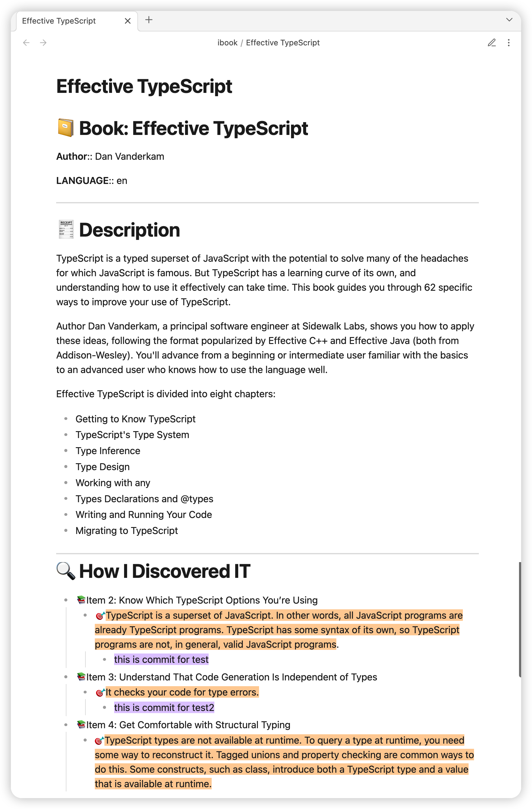

# Obsidian ibook Plugin

It allows you to export your mac ibook hightlights and annotations into your obsidian vault.

# Demo Screenshot


# Requirements

The data of mac ibook exists in local sqlite3. and this plugin select database use the local SQLite3

```shell
brew install sqlite3
```

# How to Use

`cmd+p` and input `ibook export`

# Features

- [x] export ibook hightlights and annotations into your obsidian vault.
- [x] user-defined template

# For User-Defined Templates

1. templating language: [https://handlebarsjs.com/](https://handlebarsjs.com/)
2. available parameters: [docs/parameters.md](docs/parameters.md)

## How to Install

### From within Obsidian

you can activate this plugin within Obsidian by doing the following:

- Open Settings > Third-party plugin
- Make sure Safe mode is **off**
- Click Browse community plugins
- Search for "Obsidian ibook"
- Click Install
- Once installed, close the community plugins window and activate the newly installed plugin
