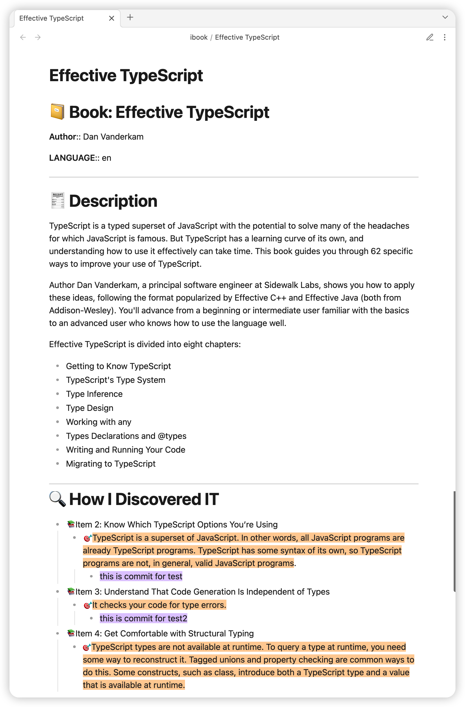

# example

plugins you might like:
- [Highlightr-Plugin](https://github.com/chetachiezikeuzor/Highlightr-Plugin): makes color-coded highlighting much easier

## default template

```
---
tags:
- ibook/
---

# 📔 Book: {{library.ZSORTTITLE}}

**Author**:: {{library.ZAUTHOR}}

**LANGUAGE**:: {{library.ZLANGUAGE}}

{{#if library.ZBOOKDESCRIPTION}}
---
# 🧾 Description
	{{{library.ZBOOKDESCRIPTION}}}
{{/if}}

---
# 🔍 How I Discovered IT

{{#group annotation by="ZFUTUREPROOFING5"}}
- 📚{{value}}
	{{#each items}}
	{{#if ZANNOTATIONSELECTEDTEXT}}
	- 🎯{{ZANNOTATIONSELECTEDTEXT}}
	{{/if}}
		{{#if ZANNOTATIONNOTE}}
		- ✍️{{ZANNOTATIONNOTE}}
		{{/if}}
	{{/each}}
{{/group}}
```

If you installed the [Highlightr plugin](https://github.com/chetachiezikeuzor/Highlightr-Plugin), you can use:

```
---
tags:
- ibook/
---

# 📔 Book: {{library.ZSORTTITLE}}

**Author**:: {{library.ZAUTHOR}}

**LANGUAGE**:: {{library.ZLANGUAGE}}

{{#if library.ZBOOKDESCRIPTION}}
---
# 🧾 Description
	{{{library.ZBOOKDESCRIPTION}}}
{{/if}}

---
# 🔍 How I Discovered IT

{{#group annotation by="ZFUTUREPROOFING5"}}
- 📚{{value}}
	{{#each items}}
	{{#if ZANNOTATIONSELECTEDTEXT}}
	- 🎯<mark class="hltr-orange">{{ZANNOTATIONSELECTEDTEXT}}</mark>
	{{/if}}
		{{#if ZANNOTATIONNOTE}}
		- ✍️<mark class="hltr-purple">{{ZANNOTATIONNOTE}}</mark>
		{{/if}}
	{{/each}}
{{/group}}
```


## old default template

```
---
tags:
- ibook/
---

# 📔 Book: {{library.ZSORTTITLE}}

**Author**:: {{library.ZAUTHOR}}

**LANGUAGE**:: {{library.ZLANGUAGE}}

{{#if library.ZBOOKDESCRIPTION}}
---
# 🧾 Description
	{{{library.ZBOOKDESCRIPTION}}}
{{/if}}

---
# 🔍 How I Discovered IT

{{#each annotation}}
{{#if this.ZFUTUREPROOFING5}}
- 📚{{this.ZFUTUREPROOFING5}}
{{/if}}
	{{#if this.ZANNOTATIONSELECTEDTEXT}}
	- 🎯{{this.ZANNOTATIONSELECTEDTEXT}}
	{{/if}}
		{{#if this.ZANNOTATIONNOTE}}
		- ✍️{{this.ZANNOTATIONNOTE}}
		{{/if}}
{{/each}}
```

