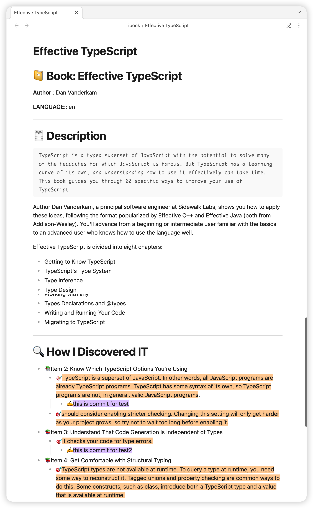

# example

plugins you might like:
- [Highlightr-Plugin](https://github.com/chetachiezikeuzor/Highlightr-Plugin): makes color-coded highlighting much easier

## ibook selected colors 

for issue [help request: highlighted text's color from ibook](https://github.com/bingryan/obsidian-ibook-plugin/issues/46), you should install [Highlightr-Plugin](https://github.com/chetachiezikeuzor/Highlightr-Plugin)
and use the template from below(update template: `setting-> ibook -> template`):

```
---
tags:
- ibook/
---

# 📔 Book: {{library.ZSORTTITLE}}

**Author**:: {{library.ZAUTHOR}}

**LANGUAGE**:: {{library.ZLANGUAGE}}

**Book Link**:: [Apple Books Link](ibooks://assetid/{{library.ZASSETID}})

{{#if library.ZBOOKDESCRIPTION}}
---
# 🧾 Description
	{{{library.ZBOOKDESCRIPTION}}}
{{/if}}

---
# 🔍 How I Discovered IT

{{#group annotation by="ZFUTUREPROOFING5"}}
- 📚{{value}}
	{{#each items}}
	{{#if ZANNOTATIONSELECTEDTEXT}}
	{{#is ZANNOTATIONSTYLE 5}}
	- 🎯 <mark style="background: #C4B3D9;">{{ZANNOTATIONSELECTEDTEXT}}</mark>
	{{/is}}
	{{#is ZANNOTATIONSTYLE 4}}
	- 🎯 <mark style="background: #E6A5AB;">{{ZANNOTATIONSELECTEDTEXT}}</mark>
	{{/is}}
	{{#is ZANNOTATIONSTYLE 3}}
	- 🎯 <mark style="background: #EDD570;">{{ZANNOTATIONSELECTEDTEXT}}</mark>
	{{/is}}
	{{#is ZANNOTATIONSTYLE 2}}
	- 🎯 <mark style="background: #A8BADE;">{{ZANNOTATIONSELECTEDTEXT}}</mark>
	{{/is}}
	{{#is ZANNOTATIONSTYLE 1}}
	- 🎯 <mark style="background: #B0D17F;">{{ZANNOTATIONSELECTEDTEXT}}</mark>
	{{/is}}
	{{#is ZANNOTATIONSTYLE 0}}
	- 🎯 <mark style="background: #E65747;">{{ZANNOTATIONSELECTEDTEXT}}</mark>
	{{/is}}
	{{/if}}
		{{#if ZANNOTATIONNOTE}}
		- ✍️{{ZANNOTATIONNOTE}}
		{{/if}}
	{{/each}}
{{/group}}
```


## default template

```
---
tags:
- ibook/
---

# 📔 Book: {{library.ZSORTTITLE}}

**Author**:: {{library.ZAUTHOR}}

**LANGUAGE**:: {{library.ZLANGUAGE}}

{{#if library.ZBOOKDESCRIPTION}}
---
# 🧾 Description
	{{{library.ZBOOKDESCRIPTION}}}
{{/if}}

---
# 🔍 How I Discovered IT

{{#group annotation by="ZFUTUREPROOFING5"}}
- 📚{{value}}
	{{#each items}}
	{{#if ZANNOTATIONSELECTEDTEXT}}
	- 🎯{{ZANNOTATIONSELECTEDTEXT}}
	{{/if}}
		{{#if ZANNOTATIONNOTE}}
		- ✍️{{ZANNOTATIONNOTE}}
		{{/if}}
	{{/each}}
{{/group}}
```

If you installed the [Highlightr plugin](https://github.com/chetachiezikeuzor/Highlightr-Plugin), you can use:

```
---
tags:
- ibook/
---

# 📔 Book: {{library.ZSORTTITLE}}

**Author**:: {{library.ZAUTHOR}}

**LANGUAGE**:: {{library.ZLANGUAGE}}

{{#if library.ZBOOKDESCRIPTION}}
---
# 🧾 Description
	{{{library.ZBOOKDESCRIPTION}}}
{{/if}}

---
# 🔍 How I Discovered IT

{{#group annotation by="ZFUTUREPROOFING5"}}
- 📚{{value}}
	{{#each items}}
	{{#if ZANNOTATIONSELECTEDTEXT}}
	- 🎯<mark class="hltr-orange">{{ZANNOTATIONSELECTEDTEXT}}</mark>
	{{/if}}
		{{#if ZANNOTATIONNOTE}}
		- ✍️<mark class="hltr-purple">{{ZANNOTATIONNOTE}}</mark>
		{{/if}}
	{{/each}}
{{/group}}
```





## old default template

```
---
tags:
- ibook/
---

# 📔 Book: {{library.ZSORTTITLE}}

**Author**:: {{library.ZAUTHOR}}

**LANGUAGE**:: {{library.ZLANGUAGE}}

{{#if library.ZBOOKDESCRIPTION}}
---
# 🧾 Description
	{{{library.ZBOOKDESCRIPTION}}}
{{/if}}

---
# 🔍 How I Discovered IT

{{#each annotation}}
{{#if this.ZFUTUREPROOFING5}}
- 📚{{this.ZFUTUREPROOFING5}}
{{/if}}
	{{#if this.ZANNOTATIONSELECTEDTEXT}}
	- 🎯{{this.ZANNOTATIONSELECTEDTEXT}}
	{{/if}}
		{{#if this.ZANNOTATIONNOTE}}
		- ✍️{{this.ZANNOTATIONNOTE}}
		{{/if}}
{{/each}}
```

